## Unit 5 - The Original Manuscript

### Table of contents
* [Recommened order for writing an original manuscript](#Recommended-order-for-writing-an-original-manuscript)
* [1. Tables and Figures](#1-Tables-and-Figures) 
	* [1.1. Table](#11-Table)
	* [1.2. Figure](#12-Figure)
* [2. Results](#2-Results)
* [3. Practice writing Results](#3-Practice-writing-Results)
* [4. Methods](#4-Methods)
* [5. Introduction](#5-Introduction)
* [6. Practice writing Introduction](#6-Practice-writing-Introduction)
* [7. Discussion](#7-Discussion)
* [8. Abstract](#8-Abstract)
* [Notes](#8-Notes)

### Recommended order for writing an original manuscript
1. **Tables and Figures**
	+ Come up with a beautiful, polished set of table/figures
	+ Tables and figures tell a story of the manuscript
	+ Each of them should have a clear point **=> joint together to tell a story**
	+ Make them look professional
2. **Results**
	+ Gives a high-level summary of each table and figure
3. **Method**
	+ Could write it anytime
4. **Introduction**
	+ Write the Table, Figures and Results before to know how to frame the Introduction
5. **Discussion**
	+ Hardest to write
	+ Involves the most writing, the most complex 
6. **Abstract**
	+ Always write the Abstract last 
	+ Abstract is easy to write after finish other sections

### 1. Tables and Figures
+ Table and Figures is t**he most important part** of a manuscript
+ Table and Figures form **_the foundation of the story_** in the manuscript.
+ Editors, reviewers, and readers may look  **_first_** (and maybe only) at Titles, Abstract, Table and Figures!
	+ Some reviewers skim the abstract just to get a sense of what the paper is about
	+ Then jump right to the table and figure.
+ Each figure and table should stand alone and tell a complete, clear story
+ Each figure and table should make a **_clear point_**
	+ We should know what point is.
	+ We should stick to that point as much as possible.
+ **Tips:**
	+ Use the fewest figures and tables needed to tell a story. **_Be concise and to the point_**
	+ Do not present the same data in both a figure and a table.
+ **Tables vs. Figures:**
	+ Figures:
		+ Visual impact
		+ Show trends and patterns
		+ Tell a quick story (single big point)
		+ Tell a whole story 
		+ Highlight a particular result (emphasize)
	+ Talbles:
		+ Give percise values
		+ Display many values/variables

#### 1.1. Table
+ **Title:**
	+ Identify the specific topic or point of the table
	+ Repeat the same key terms in the table title, the column headings and the main text of the paper
	+ Keep it brief, concise!
+ **Footnotes:**
	+ Use superscript symbols to identify footnotes (depend on the journal guidelines)
	+ Use footnotes to explain statistically significant differences
	+ Use footnoes to explain experimental details or abbreviations (aconym have to be define within the table)
+ **Format:**
	+ Model the tables from already published tables!
	+ Follow journal guidelines
	+ Most journals used three horizontal lines (above the collumn headings, below the column heading, below the data)
+ **_Example of PROFESSIONAL Table:_**:  
	  
  	+ Three horizontal lines
	+ Simple clear point
  	+ Can quickly glean what different
+ **_Example of UNPROFESSIONAL Tables:_**:
    + **Example 1**:
    	  
    	+ Grid lines => Red flag from the reviewers
    + **Example 2**:
    	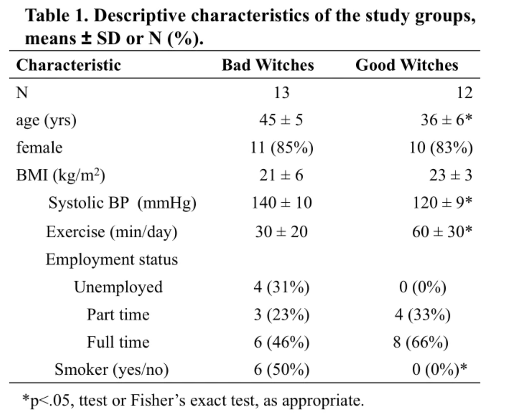  
    	+ Collums and data is misaligned. => make it line up
    	+ Some word begin with capital and some with lower case => unprofessional
    + **Example 3**:
    	  
     	+ Use a reasonable number of significant figures (i.e. decimal places)
    + **Example 4**:
    	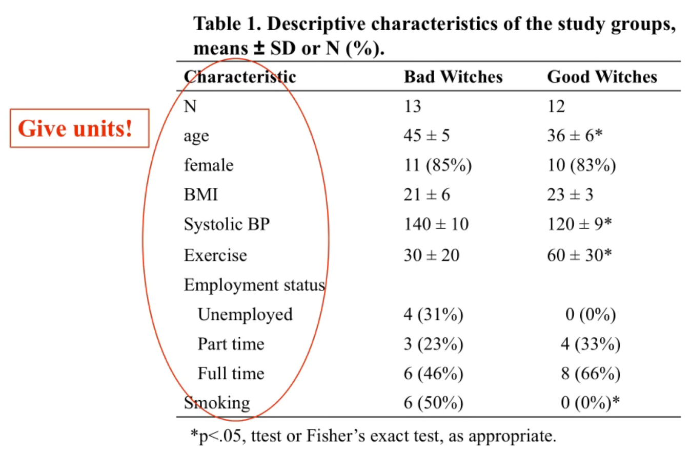  
    	+ Give Units! => Essential
    + **Example 5**:
    	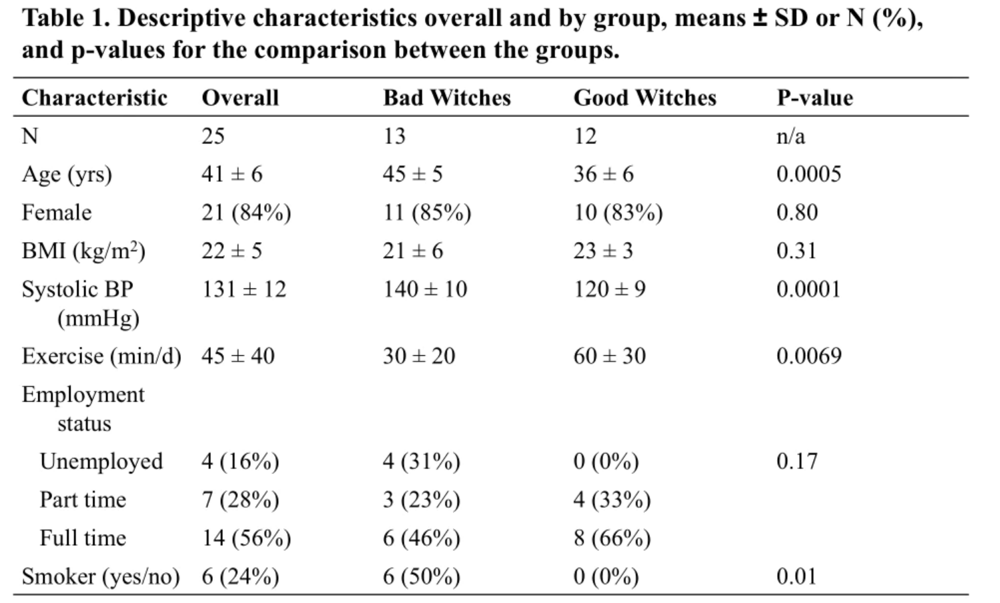  
    	+ Too many columns => detracts from the original nice, simple message => hard to read
    	+ The overall: the extra information => need to cut
    	+ The statistical significant (P-value) => can be indicated using subscripts and footnotes.

#### 1.2. Figure
+ **Types of Figure:**
	+ Primary evidence
		+ Photographs, slides, ect.
		+ Indicates data quality
		+ "Seeing is believing" => confidence to the results
	+ Graphs
		+ Line graphs, bar graphs, scatter plots, ect.
	+ Drawings and diagrams
		+ Illustrate an experimental set-up or work-flow
		+ Indicate flow of participants
		+ Illustrate cause and effect or cycles
		+ Give a hypothetical model
		+ Represent as cartoons
+ **Legends:**
	+ Allows the figure to stand alone
	+ May contain:
		+ Brief title
		+ Essential experimental details
		+ Definitions of symbols or line/bar patterns
		+ Explanation of panels (A,B,C,D,...)
		+ Statistical information (tests used, p-values)
		  
+ **Details about Figures:**	
	+ **_Primary evidence_**
		  
		+ All the informations are explained in the legend
	+ **_Graph_**
		+ **Line graphs**
			+ Trends over time, age, or dose
			+ Can display group means or individual
		  	  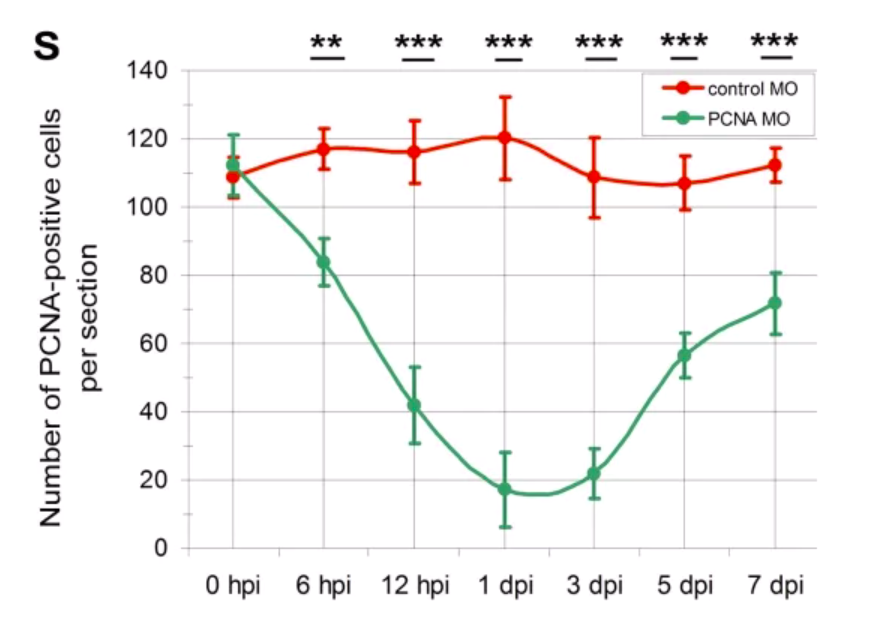
		+ **Bar graphs**
			+ Compare groups at one time point
			+ Tell a quick visual story
			  
		+ **Scatter plots**
			+ Show relationships between two (or more) variables 
			+ Allows reader to see individual data points 
			+ Gives more information!
			  
			+ Be careful, superimpose line can fool the eye
				+ Clear version
				  
				+ Fool version
				  
	+ **_Some tips for Graphs_**
		+ Tell a quick visual story
		+ Keep it simple!
		+ Make it easy to distinguish groups 
			+ E.g.square, triangle, diamond,... symbols
			+ Use different colors
		+ If it's too complex, put it to table
		    
		  => Confusing
		  => Better presented in Table
	+ **_Diagrams and Drawings_**
		+ Explaining by picture rather than by complicated text
		  
		+ Give a hypothetical model
		    
		  => This image presents data even better than using a boring table
		+ Illustrate cause and effect or cycle relationships
		  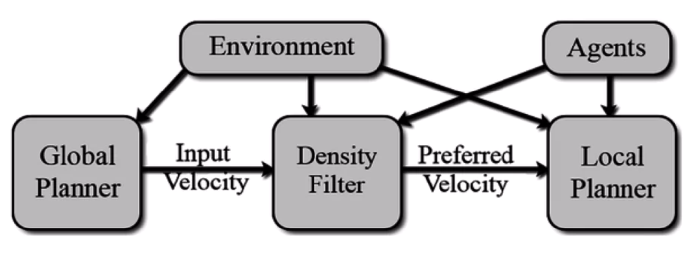
		+ Visualize something people can't see (protein,...)
		  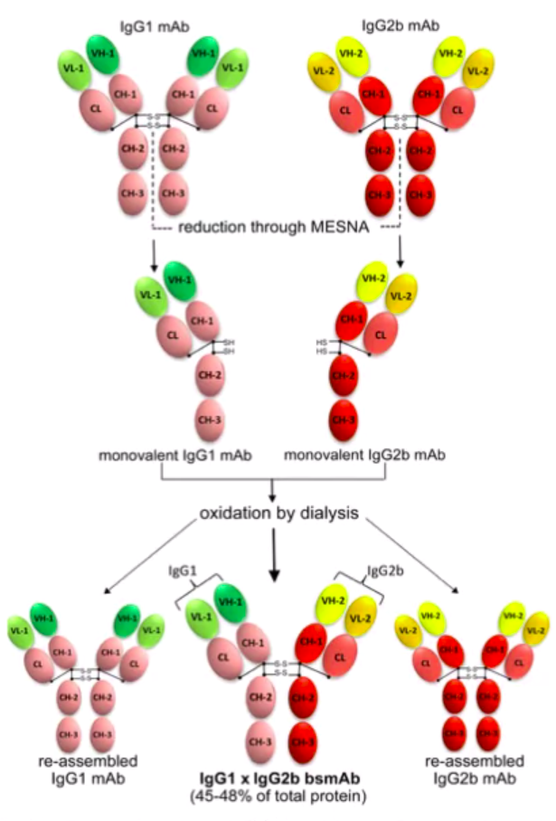

### 2. Results
+ Results != Raw Data
+ The Results section should
	+ **_Summarize_** what data show
		+ Point out simple relationships
		+ Describe big-picture trends
		+ Cite figures and tables that present supporting data
	+ Avoid simply repeating the numbers that already available in tables and figures
+ Always ask:
	+ What is the take-home message of the table?
	+ What do you want your readers to pay attention to?
+ **Examples of exemplar Results**:
	- _"Over the course of treatment, topiramate was significantly more effective than placebo at improving drinking outcomes on drinks per day, drinks per drinking day, percentage of heavy drinking days, percentage of days abstinent, and log plasma - glutamyl transferase ratio (Table 3)."_
	- _"The total suicide rate for Australian men and women did not change between 1991 and 2000 because marked decreases in older men and women (Table 1) were offset by increases in younger adults, especially younger men."_
+ **Analysis example:**
	+ Example of **what not to do** 
		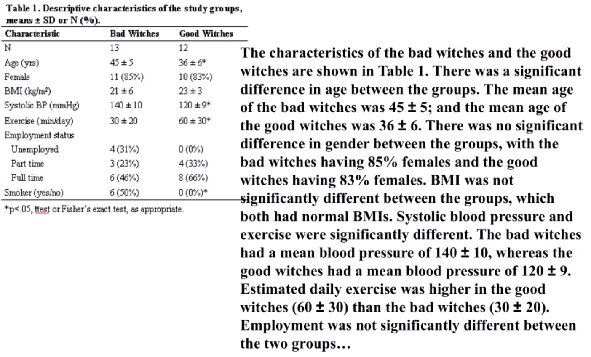  
		=> Passive voice in the first sentence  
		=> The author is literally just reading the table for the reader, line by line  
	+ **Edited**:
		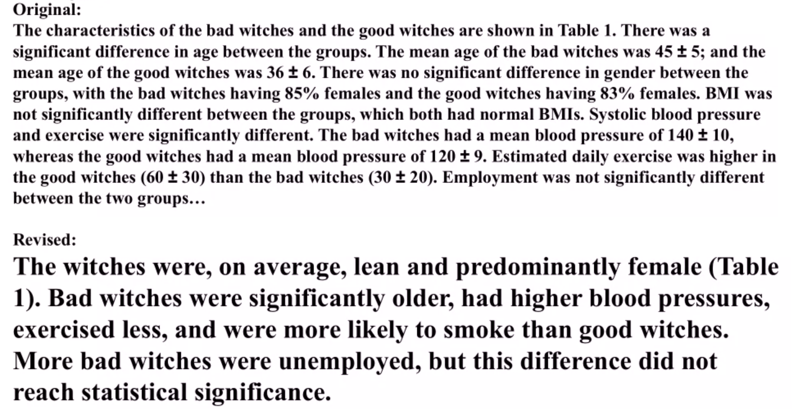  
		+ Don't waste a sentence point out the obvious ("Table 1 shows...")
		  => Launched right into the take-home messages from "Table 1" and cite the table in the parentheses  
		+ Point out how two groups differ at high level, without poiting out any numbers
		  => The readers can refer to the table for specific numbers  
		+ Include one or two key numbers to highlight for the reader
+ **Tips for writing Results:**
	+ Break into subsections, with headings (if needed)
	+ Complement the information that is already in tables/figures
		+ Give precise values that are not available in the figure
		+ Report the percent change or percent difference if absolute values are given in the table
		+ **_Example_**: _"The good witches do exercise 60 min per day while the bad witches do exercise 30 min per day"._
			- **The good witches do exercise twice as long as bad witches.**
	+ Repeat/highlight only the most important numbers
	+ Don't forget to talk about negative and control results
	+ Reserve the term **_"significant"_** for statistically significant
	+ Reserve information about what you did for the Methods section
		+ In particular, do not discuss the rationale for statistical analyses within the Results section **=> confuse reader**
	+ Reserve comments on the meaning of your Results for the Discussion section
+ **Suitable Tense for the Results:**
	+ Use **past tense** for completed actions:
		+ We **_found_** that...
		+ The average reaction time **_was_**...
		+ Women **_were_** more likely to...
		+ Men **_smoked_** more cigarettes than...
	+ Use the **present tense** for assertions that continue to be true
		+ What the tables show
			+ Figure 1 **_shows_**...
		+ What you believe
			+ We **_believe_** that this _shows_...
		+ What the data suggest
			+ The finding **_confirms_**...
		+ **_Example_**:
			_"Information **was** available for 7799 current cigarette smokers. Of these, 1216 (16%) **were** classified as hardcore smokers. Table 1 **gives** characteristics of all the smokers. The most striking difference **was** that hardcore **were** about 10 years older on average and **tended** to be more dependent on tobacco. Significantly more hardcore smokers **had** manual occupations, **lived** in rented accommodation, and **had completed** their full-time education by the age of 16 years. There **was** no difference by sex."_
	+ Use the **active voice**!
		+ More lively!
		+ Since you can talk about the subjects of your experiments, "we" can be used sparingly while maintaining the active voice!
		+ **_Example_**:
			_"To test whether it was appropriate to exclude a measure of cigarette dependence from our criteria for defining hardcore smoking, **we compared** attitudes and beliefs by dependence in hardcore and other smokers (table 4). For most items, **beliefs were** similar in low and high dependence hardcore smokers but strikingly different from those of other smokers. For example, almost 60% of both low and high-dependency non-hardcore **smokers agreed** that improved health would be a major benefit from quitting whereas among hardcore smokers only 27% of low dependency and 32% of high dependency smokers agreed. Similar **differentiation** in beliefs by hardcore smoking status, but not dependence level, **emerged** for other items, especially those related to health."_  
				=> Active voice, past tense  
				=> Nice, lively, easy to read  
				=> Only use subject "we" once.  
				
### 3. Practice writing Results
+ **_Original draft:_**
	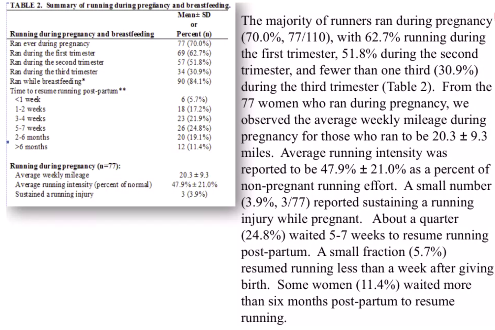  
	=> Repetition, wordiness
+ **_Edited:_** _"Seventy percent runners ran during pregnancy (n = 77) and almost one third ran during the third trimester (Table 2). On average, those who ran greatly curtailed their training — running just 20.3+/-9.3 miles per week and cutting their intensity to about half of their non-pregnant runing effort. Three reported sustaining a running injury while pregnant. In the post-partum period, nearly one quarter resumed running by two weeks after giving birth; most resumed running by two month."_  
	=> Concise, focus on relation and significant trends

### 4. Methods
+ Give a clear overview of what was done
+ Give enough information to replicate the study (like a recipe!)
+ Be complete, minimize the complexity for your reader!
	1. Break into smaller sections with subheadings
	2. Cite a reference for commonly used methods
	3. Display in a flow diagram or table where possible
+ You _may_ use jargon and the passive voice more liberally in the Methods section.
+ Who, what, where, how and why questions are considered when writing the Methods section
	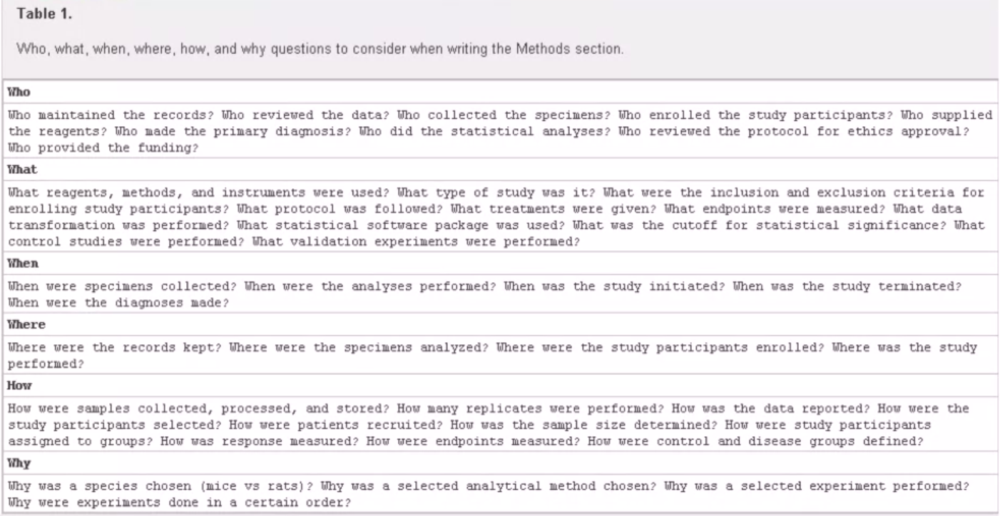  
+ The methods section should provide **_sufficient details_** so that others can replicate the study.
+ **Methods structure:**
	+ Materials
		+ Drugs, buffers, chemicals, gases, etc.
		+ Give specific informations
	+ Participants/subjects
		+ Animals/Humans (does the research was approved by appropriate committee?)
	+ Experimental protocol/study design
	+ Measurements
		+ How were the dependent and independent variables measured
		+ Instruments (telescope, microscope, weighing scale, etc.)
	+ Analyses
+  **Make life easy for the reader:**
	1. Break into subsections with informative subheadings
		+ **_Example_**:
			+ Subjects and experimental protocols
			+ Hardware
			+ Data processing
			+ Measure evaluation
	2. Cite a reference for commonly used methods or previously used methods rather than explaining all the details
		+ **_Examples_**:
			+  _"...with the used of the appropriate SVM approach, as previously described [1]."_
			+ _"...as descrived previouslu (Nguyen et al., 2020"_
	3. Use flow diagrams or tables to help simplify explanations of methods!
		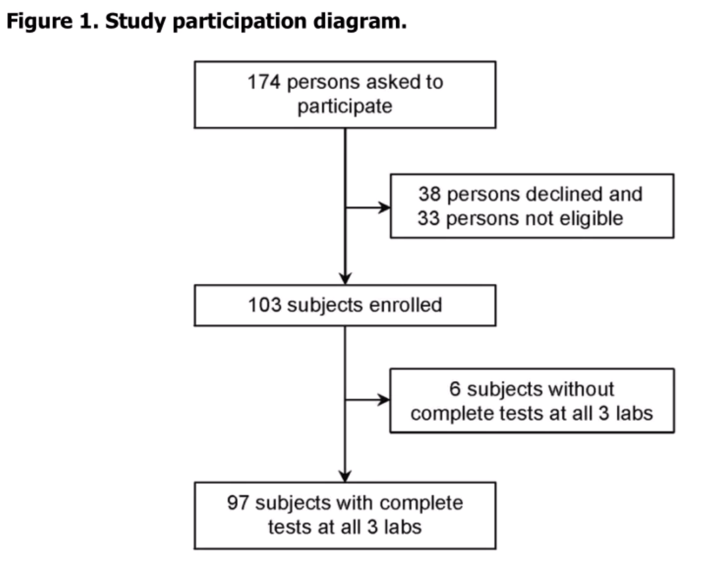  
		=> Harder to read with text, also extremely boring  
+ **Grammar:**
	+ Report methods in **past tense**
		+ We measured...
		+ We applied...
	+ Describe how data are presented in **_present tense_**
		+ The data are summarized as means...
	+ It's OK to use passive voice (or even a combination)
		+ Passive voice:
			+ Emphasize the method or variable. What was done rather than who did it,
			+ The Methods section is already boring, no one reading it word by word.
		+ Active voice:
			+ More lively, but sacrifice having the method as the subject of the sentence
			+ Requires creativity to avoid starting every sentence with "We"! (But it's not worth the effort) 
	+ Also, the jargon and acronym are OK!
	+ **_Example:_**
		_**"We assessed** the number of spam emails received in each collection phase. Detailed analysis **was undertaken** of spam received in April 2014, June 2014, and April 2015. **The investigators rated** their spam invitations as being of no, low, medium, or high relevance to their academic careers. **We determined** the number of duplicate spam invitations. When possible, **we recorded** the publisher for journal invitations and organizing body for conference invitations. Finally, **we conducted** a qualitative analysis, focusing on memorable spam."_  
		=> A lot of "We", but it reads well, easy to understand  

### 5. Introduction
+ Follows a fairly standard format
	+ Easier to write
+ Typically 3 paragraphs long
	+ Recommended range: 2 to 5
+ It is **not** an exhaustive review of the general topic
	+ Should focus on the specific question/hypothesis/aim of study
	+ **_Example_**:
		+ Topic: a study tested the association between brest cancer and smoking  
		=> Intro:  
			+ **_Not write_** background general information about breast cancer or smoking
			+ **_Not discuss_** papers about how bad smoking or brest cancer in general
			+ **_Write about_** the potential relationships between specifically smoking and breast cancer
			+ **_Discuss about_** previous study that addressed this link
+ **Introduction format:**
	  
	+ Start with something general, then narrow down quickly to the specific study
	+ **_Introduction structure 1:_**
		+ Briefly giving some context, background information about what is known on the topic
		+ Pinpoint the gaps, flaws, and limitations of all previous studies
		+ Narrow to the specific hypothesis or aim of statement
			+ Make a statement of purpose, clearly  
		+ Tell a little bit about the approach
			+ Explain how the approach is new and better than previous studies
			+ Explain how it fill the gaps and limitations
	+ **_Introduction structure 2:_** (Similar to 1, actually)
		+ Paragraph 1:
			+ What's known
		+ Paragraph 2:
			+ What's unknown
				+ Limitations and gaps in previous studies
		+ Paragraph 3:
			+ The specific study
				+ Your burning question/hypothesis/aim
				+ Your experimental approach
				+ Why your experimental approach fills in the gaps
+ **Tips for writing Introduction:**
	+ Keep paragraphs short
	+ Write for general audience
		+ Clear, concise, non-technical
	+ Take the reader step by step from what is known to what is unknown. End with the specific question.
		+ Known => Unknown => Question/Hypothesis
	+ Emphasize how the study fills in the gaps
	+ Explicitly state the research question/aim/hypothesis
		+ We asked whether...
		+ Our hypothesis was...
		+ We tested the hypothesis that...
		+ Our aim were...
		+ We proposed...
	+ Do not answer the research question (no results or implications)
		+ Just set up the research question
	+ Summarize at a high level! Leave detailed descriptions, speculations, and criticisms of particular studies for the discussion.
		+ Just tell the reader broadly what were the problems with previous studies
+ **_Examples:_**:
	+ **Simple introduction:**
		>	_"Insolicited and unwanted (spam) electronic invitations to speak at or attend conferences, or to write for or edit journals are burgeoning aspects of academic life. Colleagues regard such invitations with wry amusement, intense frustration, or resignation. Two of us (AG, ND) have review travel grant applications from colleagues who received spam invitations to give conference presentations._
		>  
		> _Few studies have focused on academic spam. In the Academic Spam study we investigated the amount, relevance, content, and suppressibility of academic spam emails."_  

		=> The first paragraphs about what was known  
		=> The second paragraphs about the specific study  
	+ **Complex introduction:**
		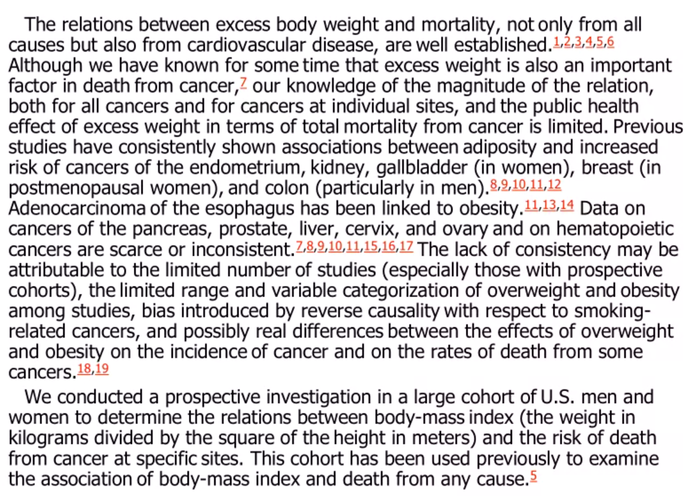  
		+ **_Paragraph 1_**:
			+ Sentence 1: What's known 
				+ Well-established relationship between obese and hearth disease    
			+ Sentence 2: What's unknown 
				+ How much does being overweight incease the risk of cancer?  
				+ What individual cancers arre related to excess weight
			+ Sentence 3: What's know
				+ What we known for sure from the previous studies
			+ Sentence 4: What's unknown 
				+ Summarized a pile of studies in just one sentence (without telling the details)
				+ They are scares inconsistent
			+ Sentence 5: Gaps and limitations
				+ Lack of consistency;Limited range and variable; Bias; ect.
		+ **_Paragraph 2_**: Specific hypothesis
			+ How this study will answer the questions with better methods
				+ Aim of study
				+ Clear scope
				+ Messure metric
	+ **Another complex example:**
		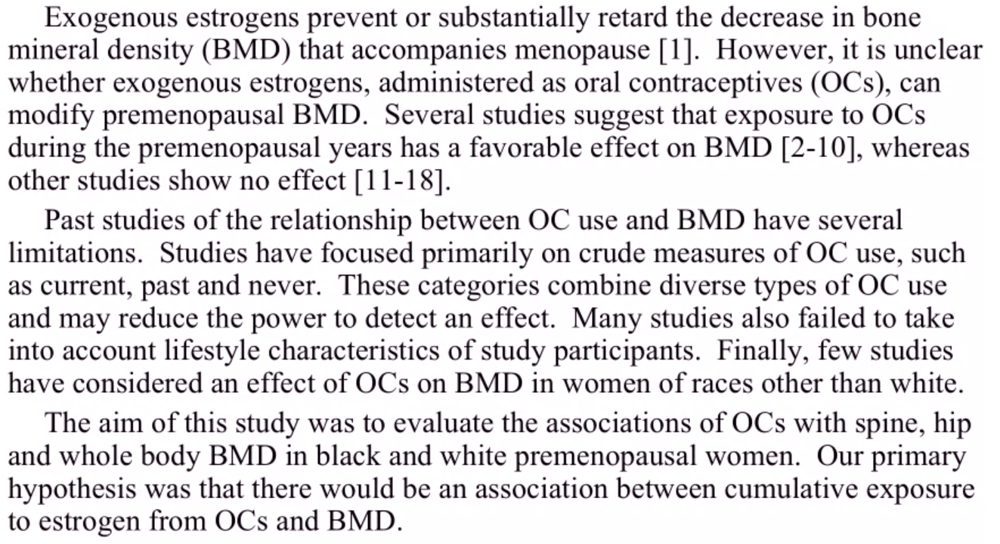  
		+ **_Paragraph 1_**:
			+ What's known
			+ What's unknown
			+ The lit. review, quick summary
		+ **_Paragraph 2_**:
			+ Gaps in previous research
		+ **_Paragraph 3_**:
			+ Aim of the study
			+ Main hypothesis statement

### 6. Practice writing Introduction
+ **Example 1:**
	+ Introduction:
		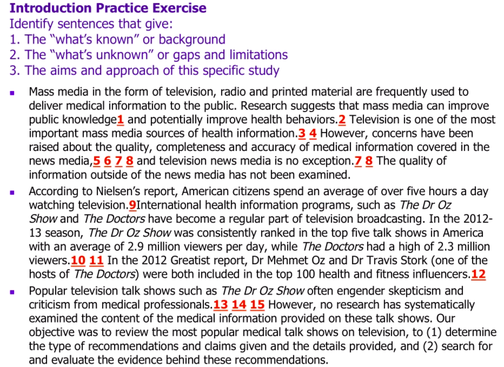  
	+ Analysis:
		+ **_Paragraph 1_**:
			+ Overview relationship (What's known)
			+ Quick summary (What's known)
			+ Limitations (What's known)
			+ Gaps (What's unknown)
		+ **_Paragraph 2_**:
			+ Previous study review
		+ **_Paragraph 3_**:
			+ Limitations (What's known)
			+ Gaps (What's unknown)
			+ Aim statement
+ **Example 2:**
	+ Introduction:
		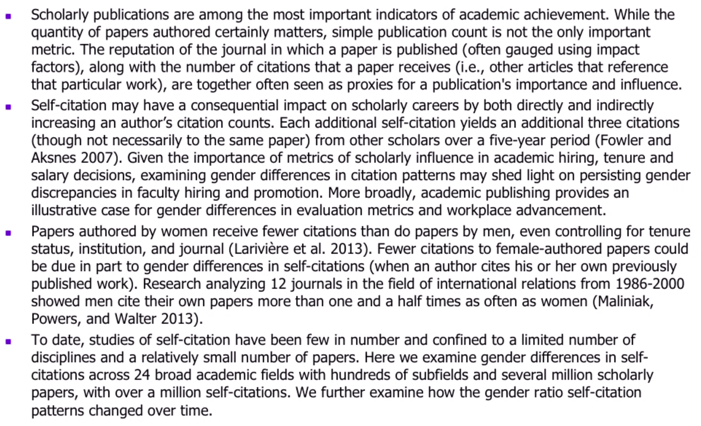  
	+ Analysis:
		+ **_Paragraph 1_**:
			+ Overview relationship
			+ Overall background
		+ **_Paragraph 2_**
			+ Why it matter
			+ Explanation 
		+ **_Paragraph 3_**:
			+ Pervious literature 
		+ **_Paragraph 4_**:
			+ Gaps and limitations (Unknown)
			+ Aim statement
			+ Examine how the gap has change over time

***
### Notes
+ One more tip on making writing easier:
	+ Break the writing task into small, reasonable, and realistic goals:
		+ **_Example:_**
			+ My goal is to write 400 words today.
			+ My goal is to write the first two paragraphs of the discussion section today.
+ Introduction:
	+ The past tense and active voice are appropriate for discussing previous results

  
  
_This notes were made by [**quanghuy0497**](https://github.com/quanghuy0497/Writing-in-the-Science_Stanford)@2021_
