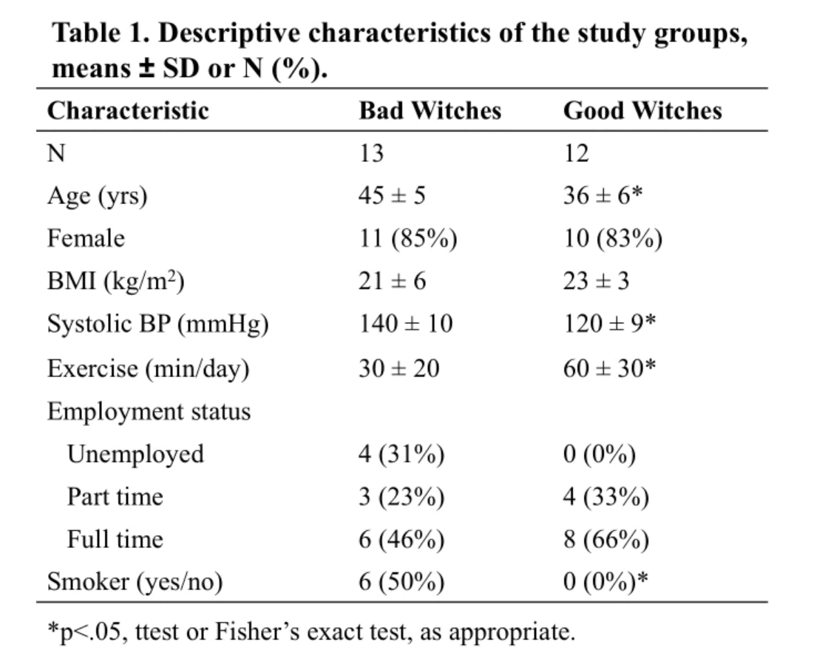
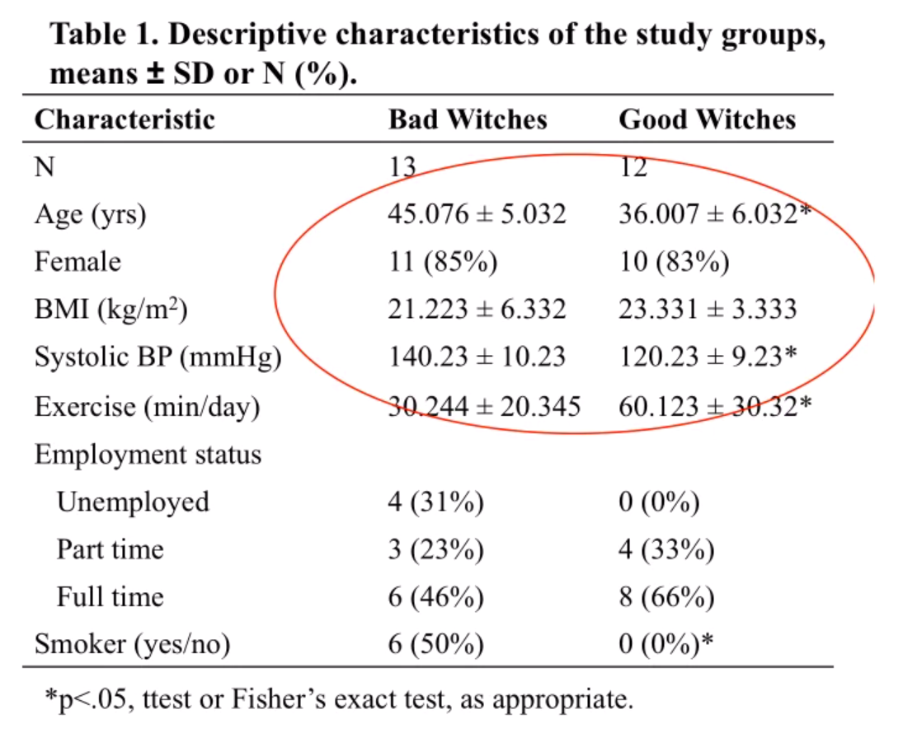
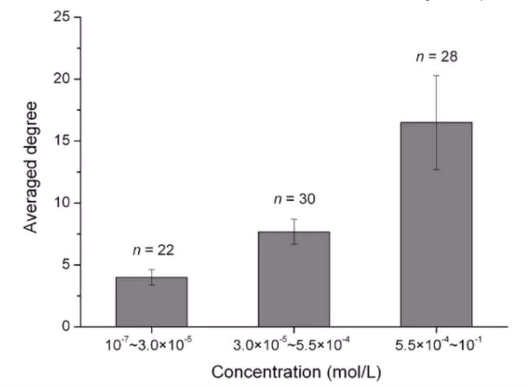
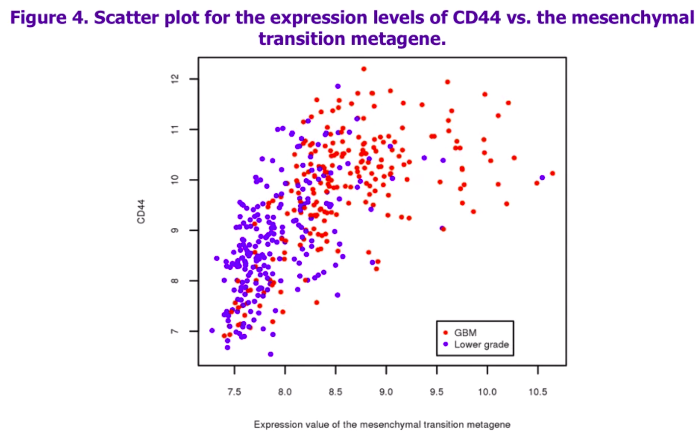
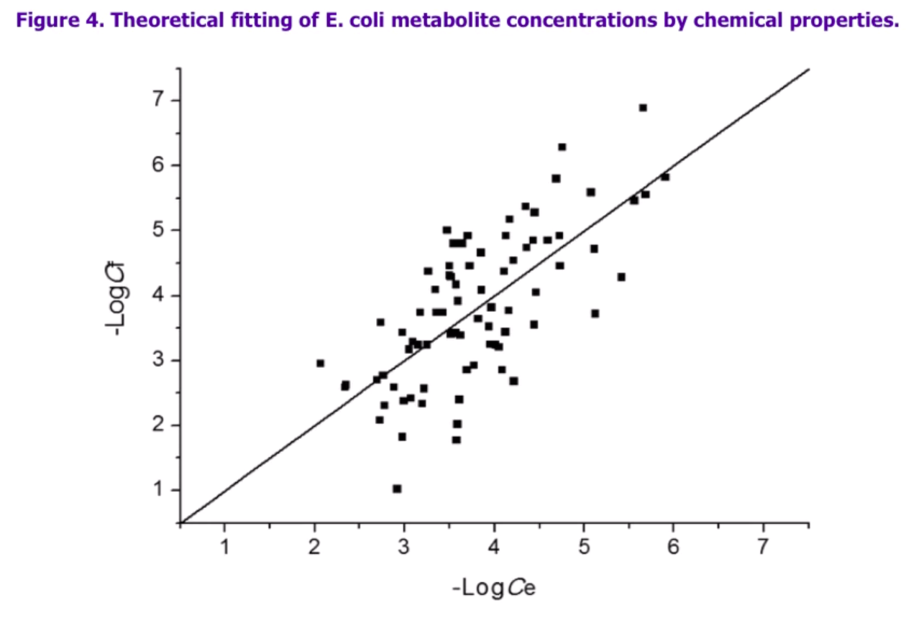
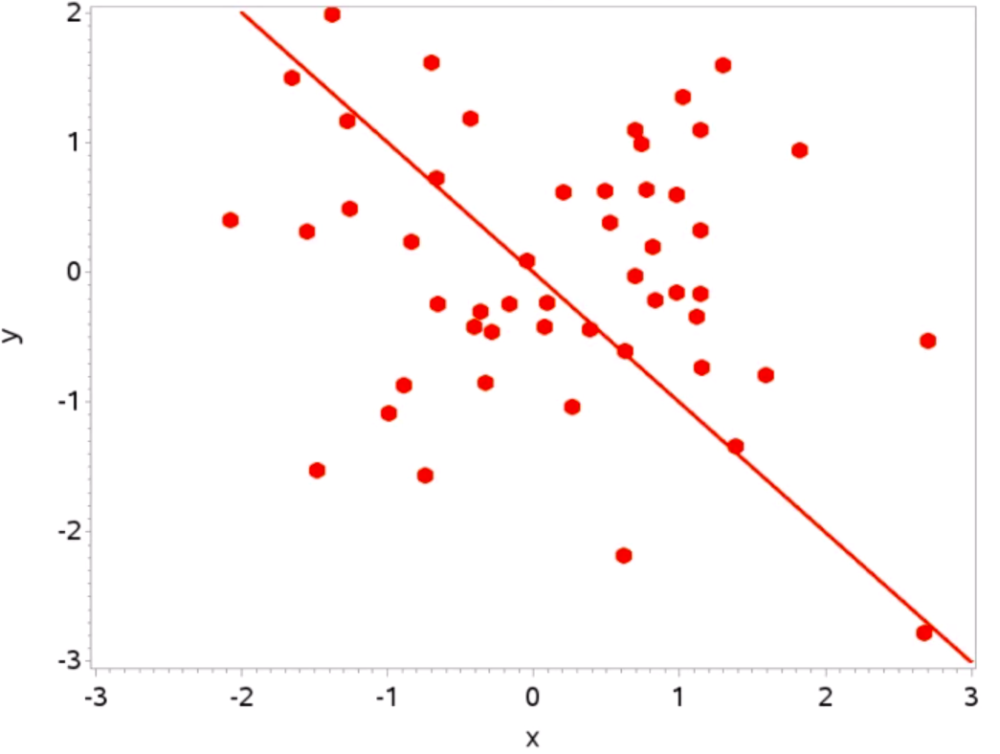

## Unit 5 - The Original Manuscript

### Table of contents
* [Recommened order for writing an original manuscript](#Recommended-order-for-writing-an-original-manuscript)
* [1. Tables and Figures](#1-Tables-and-Figures) 
	* [1.1. Table](#11-Table)
	* [1.2. Figure](#12-Figure)
* [2. Results](#2-Results)
* [3. Practice writing Results](#3-Practice-writing-Results)
* [4. Methods](#4-Methods)
* [5. Introduction](#5-Introduction)
* [6. Practice writing Introduction](#6-Practice-writing-Introduction)
* [7. Discussion](#7-Discussion)
* [8. Abstract](#8-Abstract)
* [Notes](#8-Notes)

### Recommended order for writing an original manuscript
1. **Tables and Figures**
	+ Come up with a beautiful, polished set of table/figures
	+ Tables and figures tell a story of the manuscript
	+ Each of them should have a clear point **=> joint together to tell a story**
	+ Make them look professional
2. **Results**
	+ Gives a high-level summary of each table and figure
3. **Method**
	+ Could write it anytime
4. **Introduction**
	+ Write the Table, Figures and Results before to know how to frame the Introduction
5. **Discussion**
	+ Hardest to write
	+ Involves the most writing, the most complex 
6. **Abstract**
	+ Always write the Abstract last 
	+ Abstract is easy to write after finish other sections

### 1. Tables and Figures
+ Table and Figures is t**he most important part** of a manuscript
+ Table and Figures form **_the foundation of the story_** in the manuscript.
+ Editors, reviewers, and readers may look  **_first_** (and maybe only) at Titles, Abstract, Table and Figures!
	+ Some reviewers skim the abstract just to get a sense of what the paper is about
	+ Then jump right to the table and figure.
+ Each figure and table should stand alone and tell a complete, clear story
+ Each figure and table should make a **_clear point_**
	+ We should know what point is.
	+ We should stick to that point as much as possible.
+ **Tips:**
	+ Use the fewest figures and tables needed to tell a story. **_Be concise and to the point_**
	+ Do not present the same data in both a figure and a table.
+ **Tables vs. Figures:**
	+ Figures:
		+ Visual impact
		+ Show trends and patterns
		+ Tell a quick story (single big point)
		+ Tell a whole story 
		+ Highlight a particular result (emphasize)
	+ Talbles:
		+ Give percise values
		+ Display many values/variables

#### 1.1. Table
+ **Title**
	+ Identify the specific topic or point of the table
	+ Repeat the same key terms in the table title, the column headings and the main text of the paper
	+ Keep it brief, concise!
+ **Footnotes**
	+ Use superscript symbols to identify footnotes (depend on the journal guidelines)
	+ Use footnotes to explain statistically significant differences
	+ Use footnoes to explain experimental details or abbreviations (aconym have to be define within the table)
+ **Format**
	+ Model the tables from already published tables!
	+ Follow journal guidelines
	+ Most journals used three horizontal lines (above the collumn headings, below the column heading, below the data)
+ **_Example PROFESSIONAL Table_**:  
	  
  	+ Three horizontal lines
	+ Simple clear point
  	+ Can quickly glean what different
+ **_Example UNPROFESSIONAL Tables_**:
    + **Example 1**:
    	  
    	+ Grid lines => Red flag from the reviewers
    + **Example 2**:
    	  
    	+ Collums and data is misaligned. => make it line up
    	+ Some word begin with capital and some with lower case => unprofessional
    + **Example 3**:
    	  
     	+ Use a reasonable number of significant figures (i.e. decimal places)
    + **Example 4**:
    	  
    	+ Give Units! => Essential
    + **Example 5**:
    	  
    	+ Too many columns => detracts from the original nice, simple message => hard to read
    	+ The overall: the extra information => need to cut
    	+ The statistical significant (P-value) => can be indicated using subscripts and footnotes.

#### 1.2. Figure
+ **Types of Figure**
	+ Primary evidence
		+ Photographs, slides, ect.
		+ Indicates data quality
		+ "Seeing is believing" => confidence to the results
	+ Graphs
		+ Line graphs, bar graphs, scatter plots, ect.
	+ Drawings and diagrams
		+ Illustrate an experimental set-up or work-flow
		+ Indicate flow of participants
		+ Illustrate cause and effect or cycles
		+ Give a hypothetical model
		+ Represent as cartoons
+ **Legends**
	+ Allows the figure to stand alone
	+ May contain:
		+ Brief title
		+ Essential experimental details
		+ Definitions of symbols or line/bar patterns
		+ Explanation of panels (A,B,C,D,...)
		+ Statistical information (tests used, p-values)
		  
+ **Details about Figures**	
	+ **_Primary evidence_**
		  
		+ All the informations are explained in the legend
	+ **_Graph_**
		+ **Line graphs**
			+ Trends over time, age, or dose
			+ Can display group means or individual
		  	  
		+ **Bar graphs**
			+ Compare groups at one time point
			+ Tell a quick visual story
			  
		+ **Scatter plots**
			+ Show relationships between two (or more) variables 
			+ Allows reader to see individual data points 
			+ Gives more information!
			  
			+ Be careful, superimpose line can fool the eye
				+ Clear version
				  
				+ Fool version
				  
	+ **_Some tips for Graphs_**
		+ Tell a quick visual story
		+ Keep it simple!
		+ Make it easy to distinguish groups 
			+ E.g.square, triangle, diamond,... symbols
			+ Use different colors
		+ If it's too complex, put it to table
		    
		  => Confusing
		  => Better presented in Table
	+ **_Diagrams and Drawings_**
		+ Explaining by picture rather than by complicated text
		  
		+ Visualize some thing people can't see (protein,...)
		  

***
### Notes
+ One more tip on making writing easier:
	+ Break the writing task into small, reasonable, and realistic goals:
		+ **_Example:_**
			+ My goal is to write 400 words today.
			+ My goal is to write the first two paragraphs of the discussion section today.

  
  
_This notes were made by [**quanghuy0497**](https://github.com/quanghuy0497/Writing-in-the-Science_Stanford)@2021_
